# MSXVI AFE Design
## Goals

* Condense the MSXV design  
* Switch from pin header connectors to an NGFF key connection
* Optimize for factory assembly
* Increase thermistor count  
* Increase balance current  
* Optimize thermal performance  
* Utilize proper state transitioning  
* General optimizations

## Overview

The AFE board in our BMS system has a couple of responsibilities:

1. Measuring and balancing battery cells: The main IC (ADBMS1818) will measure the voltages of our 36 battery cells (18 per board) through an external RC filter, compare them with one another, and using internal FETs, discharge higher voltage cells at a maximum current of 200mA in order to balance the cells. This allows the battery system to charge more efficiently, and prevents various issues. There are also methods embedded within the chip which allow us to sleep/passively monitor the battery pack via firmware (see notes on DTEN and WDT pins), previously not taken advantage of.  
2. Sensing battery and ambient temperatures: Through the use of 32 10k ohm NTC thermistors, we can sense the temperature in each battery module, as well as at arbitrary points inside the battery box. The thermistors get biased by a 3V rail on the ADBMS1818, and sorted through by a mux controlled by GPIO. The readings are taken by an ADC in the 1818\.  
3. Communicating with sibling and master modules: The two AFE boards are daisy-chained, with the first being connected to the master module (BMS carrier) on the rear controller. All of these boards communicate with one another using a differential 2-wire system: isoSPI. The AFE’s connect to the combinator board in the battery box via an NGFF plug and key, and the combinator board relays signals between the rear controller and the attached AFE’s.

## Contents
[**Design**](#design)

[External Architecture](#external-architecture)

[Top Sheet](#top-sheet)

[AFE IC](#afe-ic)

[Connectors](#connectors)

[Regulator](#regulator)

[Layout](#layout)

[3D Model](#3d-model)

[Bill of Materials](#bill-of-materials)

[**Component Selection**](#component-selection)

[AFE IC](#afe-ic-1)

[Measure/Balance Lines](#measure/balance-lines)

[isoSPI Prep](#isospi-prep)

[Regulator](#regulator)

[Thermistors/DTEN/WDT](#thermistors/dten/wdt)

[**NGFF Considerations**](#ngff-considerations)

[I/O Chart](#i/o-chart)

[Possible Layout](#possible-layout)

[**Regulator Test Board**](#regulator-test-board)

[Alterations](#alterations)

[Schematic](#schematic)

[Layout](#layout-1)

[**Layout**](#layout-2)

[Overview](#overview-1)

[MP4582](#mp4582)

[ADBMS1818](#adbms1818)

[Balance Lines](#balance-lines)

## Links
[Docs](https://docs.google.com/document/d/10tVF-HHXZznOAiI3LTjYB9GgmXYDa2oydIqfA1RCnH0/edit?usp=sharing)  
[Altium](https://university-of-waterloo-solar-car-team.365.altium.com/designs/544CD16C-370F-4F2F-993F-E860E0914D96?variant=[No+Variations]&activeDocumentId=BMS_AFE.PcbDoc&activeView=3D&location=[3,41.33,29,0.07,41.33,29,-51.74,0,1,0]#design)  
[Confluence](https://uwmidsun.atlassian.net/wiki/spaces/ELEC/pages/4166713349/Analog+Front+End+MS16)

# Design

## External Architecture

## Top Sheet
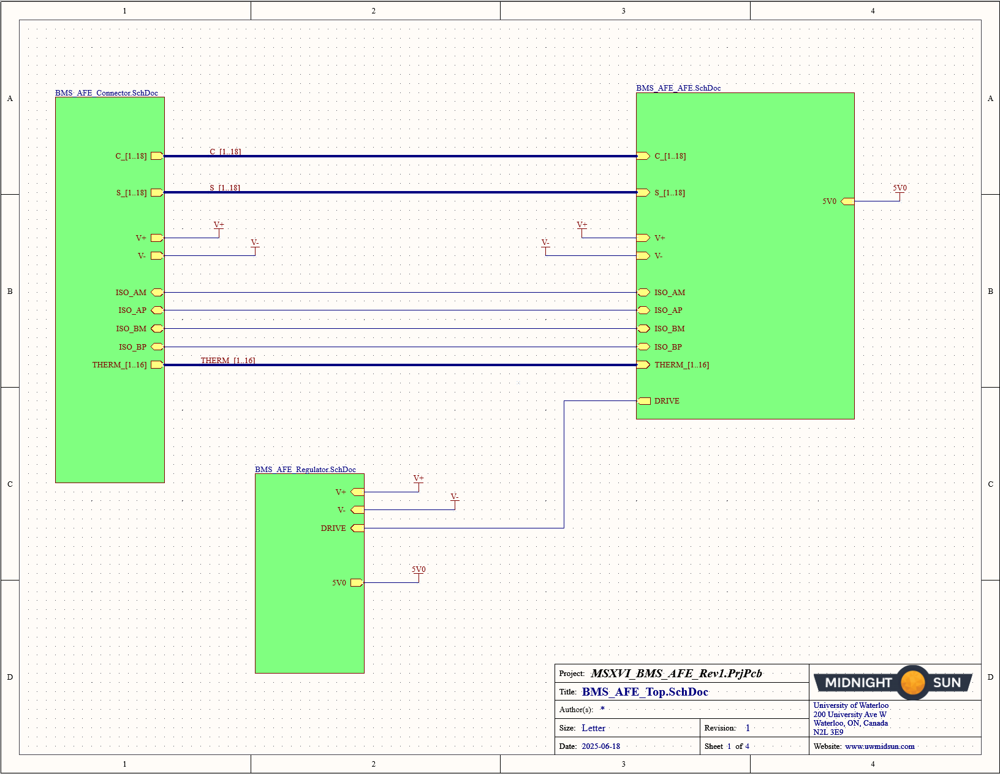
## AFE IC
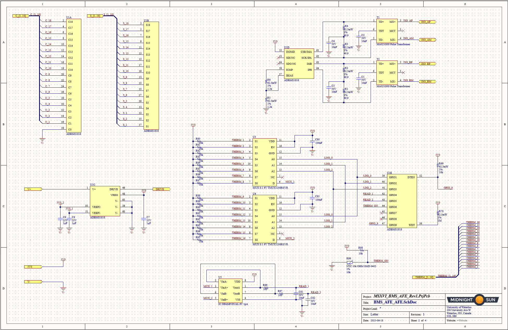
## Connectors
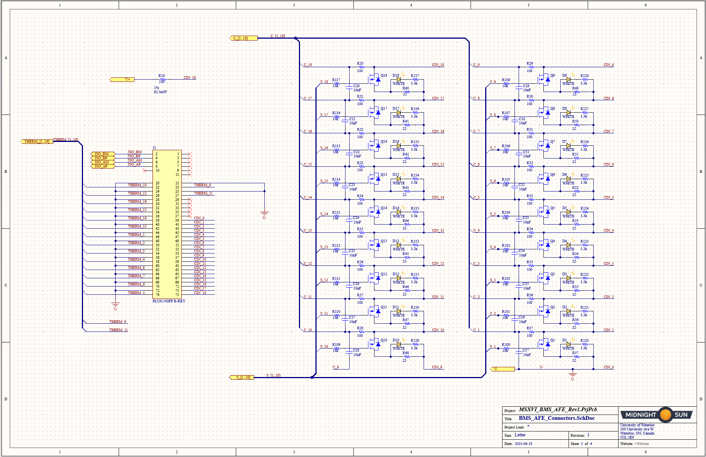
## Regulator
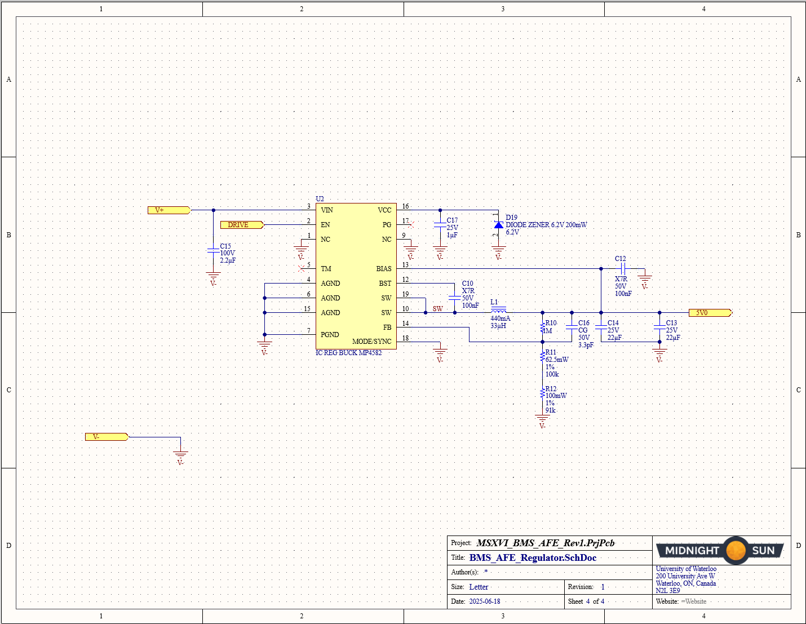
## Layout
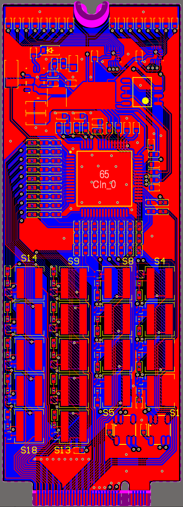
## 3D Model
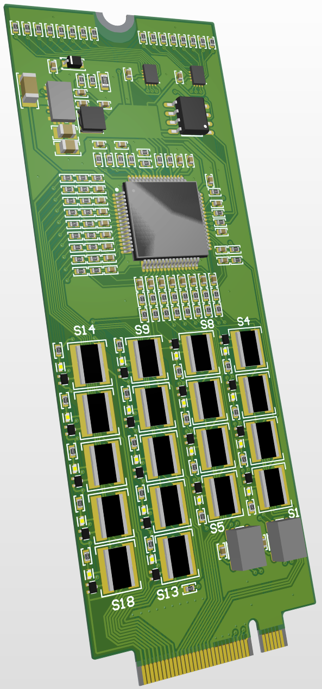
## Bill of Materials
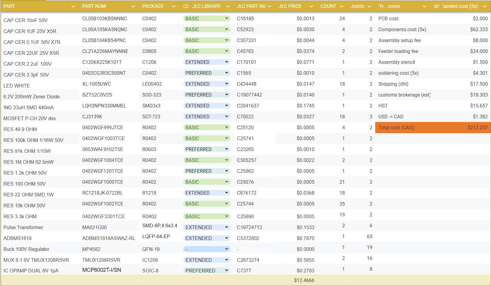
[Link to Spreadsheet](https://docs.google.com/spreadsheets/d/1oPkCh2J2IVgju8AG5fWNMNWFo74rBqJftM4ZnSj-AQ4/edit?usp=sharing) 

# Component Selection

# AFE IC

\*Datasheets linked to components
  
Will approach this design using the ADBMS1818

# Measure/Balance Lines

The Cn and Sn pins do not require any resistor/mosfet/capacitor between themselves and the cell inputs, unlike MSXV’s design.  
^WRONG:

We must have a resistor on the S line to dissipate most of the heat/current before entering the ADBMS. This calculation is done by dividing the nominal cell voltage of our batteries (3.635V) by the balance current (200mA). The ideal resistor on each line will therefore be 18.175 ohms… use 18.2 for a normal component value. The power dissipated here will be: 728mW… this is quite a bit and will require consideration on resistor power ratings.  
Wait, we don’t want the balancing current to exceed 200mA: There is no given berth for this. Let's redo the calculation and give a little bit of a berth: 3.635V/0.18A \= 20.2, using a 20.5 ohm resistor the balance current will just barely exceed 200mA (204mA) at 4.2V. This should be okay especially considering the internal 10 ohm resistor – *Afterthought: to be safe we will make sure the current is under 200mA even at 4.25V. Only use*. So we need a 22 ohm resistor with a  voltage rating of 100V, and power rating greater than (0.2)^2\*22=880mW. Looks like it will likely be a 1206 package solution.  
Unfortunately, even this won't be good enough for an application based in heat dissipation. It seems SMD resistors are not the move for this… If we really want reliable heat dissipation, let’s sacrifice a bit of space and look at other types of resistors; specifically through-hole metal film and wirewound. Let’s aim for this to be rated up to 3W, in order to ensure smooth heat dissipation. After some research, it appears wirewound will be the most precise and capable option, however, due to the solenoid nature of the component, it will produce inductance. This is okay for our purposes, however, as the traces are not long and the interference will not be significant enough to affect signals significantly.  
Looking through the JLC basic/preferred library, there is a 2W rated option available with good stock. The heat rating on this is good enough for the component to function at ambient temps up to 180C… More than enough, if it gets that high there are likely other issues.

RC filtering: could be useful in allowing for more accurate voltage measurement on each cell. Is it worth the space it will take up? First let’s see what size of resistors and capacitors will be needed:  
According to the datasheet and many other sources such as [this](https://community.nxp.com/t5/Other-NXP-Products/MC33774-RC-filter-design-for-cell-voltage-sensing/m-p/1908729), the filter resistors should all stay as close to 10 ohms as possible (this is not applicable to the *RC filter resistor* which is not on the balancing line). The power dissipated across this resistor will be minimal, as the largest current draw on V+ is in the low milliamps. No consideration needed. Voltage rating also won’t need to be considered much… an 0201 could likely work for this purpose (Afternote: 0402 basic will be cheaper and not too much more space). I think the benefit of the filter outweighs the small space taken up. So, going ahead with this, we need an ~~0201~~ 0402 100 ohm resistor on each C line. What about the capacitor? The datasheet recommends in typical applications a 100nF capacitor going to ground line. This would require a 100V rating. Do we need a capacitor between each line?

Taking a step back and looking at the provided graphs on the next page, I believe that a 10nF capacitor would pair best with a 100 ohm resistor in order to minimize measurement error in voltage and GPIO. Due to the nature of our application, only one filter type should be needed (we could likely get away with no filter, but I believe the space trade off is worth it). Differential filtering (between lines, not from lines to ground) appears to be the most effective method of filtering, although both would work fine. So, a 10nF cap with a 25V rating would be effective enough. This can likely be 0402 package.

Big issue… the current idea does not work as it causes the lower battery RC filter resistor to be in series with the balance line when the internal S pin MOSFET is activated. Turns out we will need external MOSFETS after all… For this we have chosen an SOT-723 package with a low on resistance at a gate to source voltage of 2.5V (taken from the ADBMS1818 datasheet). This will allow us to route the balancing line straight from the positive node of the cell to the negative, when the S pin is low (connected to the negative node via the internal MOSFET).

Now that that’s sorted, let’s put some LEDs in parallel with the new balance line, allowing for indication of which cell is balancing at any given moment. For this we need an LED in series with a current limiting resistor (3.3k ohm chosen). Both will be 0402\.

# isoSPI prep

Capacitive coupling vs Transformer isolation  
Transformer will take up more space but is more reliable and better suited for our application  
Transformer used by eval example: [HM2102NL](https://www.mouser.ca/datasheet/2/447/HM2102NL-2903283.pdf)  
Final daisy chain unused terminal… must be terminated… could be done by the control board in order to maintain identical afe’s? Yes \- controller board will need 100 ohm termination on the 2nd (daisy chained) AFE IPB/IMB pins

NOTE: “The isoSPI signal traces must be as direct as possible while isolated from adjacent circuitry by ground metal or space. No traces must cross the isoSPI signal lines, unless separated by a ground plane on an inner layer.”

List of recommended transformers on the next page

“The hardware design of a daisy-chain isoSPI bus is identical for each device in the network due to the daisy-chain point to point architecture. The simple design as shown in Figure 103 is functional, but inadequate for most designs. The termination resistor, RM, must be split and bypassed with a capacitor, as shown in Figure 104\. This change provides both a differential and a common mode termination, and as such, increases the system noise immunity.”  
^this is not needed for our short transmission applications

This transformer matches the specs of the recommended ones, but is smaller:

[https://www.lcsc.com/datasheet/lcsc\_datasheet\_2410122041\_CND-tek-MA021G00\_C19724713.pdf](https://www.lcsc.com/datasheet/lcsc_datasheet_2410122041_CND-tek-MA021G00_C19724713.pdf) 

“Select IB and K (signal amplitude VA to receiver comparator threshold ratio) according to the application: ► For lower power links: IB \= 0.5 mA and K \= 0.5. ► For full power links: IB \= 1 mA and K \= 0.5. ► For long links (\>50m): IB \= 1 mA and K \= 0.25. For applications with little system noise, setting IB to 0.5 mA is a good compromise between power consumption and noise immunity. Using this IB setting with a 1:1 transformer and RM \= 100 Ω, RB1 must be set to 3.01 k, and RB2 set to 1 kΩ.”

# Regulator

While it is possible to use an npn transistor to generate the 5V0 required for Vreg, it is more efficient to use a switching regulator  
Refer to page 71 of the datasheet  
Recommended component: [https://www.analog.com/media/en/technical-documentation/data-sheets/lt8631.pdf](https://www.analog.com/media/en/technical-documentation/data-sheets/lt8631.pdf)   
This is small, is powerful enough and well suited for our application. I don’t see any reason to find an alternate. Nevermind its expensive, see below.

Could we put the regulator on the rear controller, and send Vreg to the AFE’s via one of the NGFF ports? This would save space on the AFE’s and the cost of duplicating components.  
NO \- Different Ground on each AFE

The recommended regulator is very expensive… so, as a result, let’s look for different, cheaper and more efficient options.

We are going to go with the MP4582 100V buck converter due to the parts being free (sponsorship kinda), as well as it being a much cheaper alternative to the analog recommended component above.

Inductor: Based on formulas and information provided by the MP4582 Datasheet, we selected a 33uH inductor rated for saturation at 440mA. This is enough as the largest current it could face is approximately 240mA. Larger the inductor, better (smaller) the ripple current.

For calculations:  
Vout \= 5V  
Vin \= 76.5V  
Iout \= 0.027A  
Fsw \= 400kHz

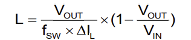 This is a simplified formula given by the datasheet, but it is not effective for our low current application, as, using the formula, any reasonable inductance gives upwards of 1000% ripple current.

Input & Output capacitors: Based on formulas on the datasheet, for a 0.1V fluctuation due to switching current draw, we should include parallel capacitance on the Vin line in order to prevent major stress on the V+ supply. For this we will use a 2.2uF capacitor rated for 100V (76.5V to ground is needed). For output, see also the formulas located in the buck converter datasheet. We have chosen the recommended 22uF.

A 3.3pF capacitor has been placed on the FB line to the Vout line in order to combat HF noise caused by switching and neglected by the large 1M ohm resistor. This is in accordance with the recommended application diagram on the datasheet.

# Thermistors/DTEN/WDT

We use 10K NTC thermistors in order to get a general idea of temperature, and pause battery activity when the heat rises above a certain threshold.

[https://resources.altium.com/fr/p/temperature-sensors-ntc-thermistors](https://resources.altium.com/fr/p/temperature-sensors-ntc-thermistors)

Will need to upgrade the MSXV mux selection to accommodate more thermistor inputs. There will be a total of 9 thermistors being handled on each AFE board, meaning my mux array must accommodate for 9 inputs.

As the power requirements are very low for the pull up resistors attached to Vref2, I will swap MSXV’s choice of 2 x 1206 resistor arrays for 9 x 0201 resistors. This will help save space and cost (able to use JLC basic/preferred components). NO LONGER THE CASE: We now have 16 thermistors per AFE. This means we can use 4 of the 1206 arrays and save space as well as permit easier manufacturing, etc.

Wait… we have 9 therm inputs on the 1818 (analog/GPIO)... we don’t even need a mux unless we want to save GPIO pins for something else (not applicable at this time). So no mux is needed. All we need to do is prepare the thermistor temperature voltages for these inputs.

Wait again… currently DTEN is tied high constantly. It would be better (easier to enter sleep mode) if we used a GPIO to control whether DTEN is high or low. But using a GPIO on the AFE IC is not an option if we use all 9 for thermistors… What if we used a GPIO coming from the rear controller to control the DTEN pin on each AFE? This way, our system is more reliable. We can stop unnecessary isoSPI relay attempts by the second AFE, as well as enter sleep mode reliably.   
NO, this will not work. The rear controller/combinator boards have different reference grounds. So let’s go back to looking at a mux… It appears the battery team would now like 32 thermistors instead of 18\. This means we would need 16 handled on each AFE… so 2 x 3 bit muxes would do. Using I2C muxes, 2 GPIO pins would control the mux, while one would take in the thermistor readings. This is derived from the recommended application in the 1818’s datasheet (page 88).  So let’s figure out which mux is best for our applications.

The 1818’s datasheet recommends another analog product of course… the ADG728. Yikes this is an expensive mux. 2 of them would add over $10 USD to the unit cost… not ideal. Let’s see if we can find something similar for less cost.  
In doing research, there are many options, but most have a relatively high impedance (60 ohms or greater). While that is doable and this is not a major issue… the TMUX1208 is another much cheaper (\~50 cent) option which boasts an impedance of only 5 ohms at 5V supply, while also being controllable by a 3 bit GPIO signal. 

Using the TMUX1208, I selected the QFN package for its small size. It requires a decoupling capacitor between 0.1 and 10 uF on the VDD line (chose an 0402 50V 0.1uF component). Buffers were added to assist in the volatile thermistor signal integrity. This was done according to the datasheet, using an alternative op-amp taken from MSXV’s design… cheaper than the recommended part, and suitable for our purposes (only drawback is 300uA leakage vs 60uA, but the recommended LTC6255 is out of stock and \~20x the price). The enable pin on the TMUX is tied to Vreg (same as VDD), allowing it to always be running whenever the ADBMS1818’s DRIVE pin is high.

For buffers, we have selected a dual operational amplifier from the JLC basic library in order to save space (instead of using 2 typical op amps).

Idea: use a mosfet and an LED to switch (and indicate the state) between DTEN high and low.

We can simplify the above idea by using a 5V tolerant GPIO pin (GPIO 9), driven to 0 to set DTEN low, and put in input (high-Z) mode to set DTEN high.

Note: the WDT pin must be left floating or pulled up to Vreg through a 1M ohm resistor for the watchdog timer to be configurable through firmware. It is undesirable to leave pins floating for many reasons involving EMI and uncontrolled pin voltage, so I’ll tie the pin up to the 5V rail.

In order to monitor the cell balancing network’s temperature, we will put another 10k NTC onboard (SMD 0402 package). For this, we selected the Murata NCP15XH103F03RC, which is available in string, leaded and SMD form factors to simplify firmware’s temperature interpretation formulas. It is placed as close to the balancing network as possible, right underneath the balance resistors, and gets routed to a separate GPIO pin from the main thermistor network.

# NGFF Considerations

Taking into account 2 thermistors per module, each requiring their own ground:

Number of pins needed for 18s AFE (4.5 modules):  
19 cell pins  
4.5\*(2therm \+ 2ground) \= 18 therm/gnd pins  
2 isospi pins  
19+16+2= 37

Number of pins needed for 12s AFE (3 modules):  
13 cell pins  
3\*(2therm \+ 2gnd) \= 12 therm/gnd pins  
2 isospi pins  
13+12+2= 27

An NGFF key will always have 67-75 pins. Either way we will be leaving some connections unused so no consideration needed there.  
One more thing to consider: ipc standards \-\> must follow below:

Likely qualifies as B4? Maybe B2. Doesn’t really matter \-\> focus on layout

# I/O Chart

| Pin           | Max Voltage (≈) Relative to V- |
|---------------|----------------------------------|
| Cell_0        | 0 V                              |
| Cell_1        | 4.25 V                           |
| Cell_2        | 8.5 V                            |
| Cell_3        | 12.75 V                          |
| Cell_4        | 17 V                             |
| Cell_5        | 21.25 V                          |
| Cell_6        | 25.5 V                           |
| Cell_7        | 29.75 V                          |
| Cell_8        | 34 V                             |
| Cell_9        | 38.25 V                          |
| Cell_10       | 42.5 V                           |
| Cell_11       | 46.75 V                          |
| Cell_12       | 51 V                             |
| Cell_13       | 55.25 V                          |
| Cell_14       | 59.5 V                           |
| Cell_15       | 63.75 V                          |
| Cell_16       | 68 V                             |
| Cell_17       | 72.25 V                          |
| Cell_18       | 76.5 V                           |
| Therm_1       | 3 V                              |
| ThermGnd_1    | 0 V                              |
| Therm_2       | 3 V                              |
| ThermGnd_2    | 0 V                              |
| Therm_3       | 3 V                              |
| ThermGnd_3    | 0 V                              |
| Therm_4       | 3 V                              |
| ThermGnd_4    | 0 V                              |
| Therm_5       | 3 V                              |
| ThermGnd_5    | 0 V                              |
| Therm_6       | 3 V                              |
| ThermGnd_6    | 0 V                              |
| Therm_7       | 3 V                              |
| ThermGnd_7    | 0 V                              |
| Therm_8       | 3 V                              |
| ThermGnd_8    | 0 V                              |
| Therm_9       | 3 V                              |
| ThermGnd_9    | 0 V                              |
| Therm_10      | 3 V                              |
| ThermGnd_10   | 0 V                              |
| Therm_11      | 3 V                              |
| ThermGnd_11   | 0 V                              |
| Therm_12      | 3 V                              |
| ThermGnd_12   | 0 V                              |
| Therm_13      | 3 V                              |
| ThermGnd_13   | 0 V                              |
| Therm_14      | 3 V                              |
| ThermGnd_14   | 0 V                              |
| Therm_15      | 3 V                              |
| ThermGnd_15   | 0 V                              |
| Therm_16      | 3 V                              |
| ThermGnd_16   | 0 V                              |
| IsoSPI+

# Possible Layout

Cell pins in order on top side, along with isospi on the notch  
Therm and gnd pins in order on the bottom side, notch empty

Idea:

^This layout will work for both 12s and 18s variations, but we are going to use 18s  
NOTE: As we switched from 9 to 16 thermistor inputs per AFE, the entire underside will be populated with alternating Therm/Gnd connections, as well as some pins between the isoSPI and lower voltage cell inputs. See schematic… Due to the nature of the layout, this idea has been altered to accommodate for more direct routing, while staying conscious of the potential difference across adjacent pads. See schematic and layout for pin assignments. The finalized layout is very similar to the proposal above, with some slight changes to the thermistor/gnd pins.

# Regulator Test Board

We will design a test PCB for the regulator portion of the AFE in order to verify its functionality. We’ll use the same circuit present in the AFE, but isolate it and include many test points while replacing small components with larger, more easy to manipulate parts.  
[Regulator Testing](https://docs.google.com/document/d/1izWtIO584cmW1-A0-uNx3t-gpRHs0d15RXw3eTLbgqQ/edit?usp=sharing)

# Alterations

- Replace schem ports with connectors, preferably header pins or copper posts.  
- Replace 0402s with at least 0603s (0805s)  
- Maintain tight layout on the switching node  
- 0805 pads for 0603 components  
- mode/sync jumper to gnd and VCC  
- Enable jumper  
- Test points: multiple ground, mode/sync, PG, etc. see schem  
- Large layout for ease of assembly and probing  
- Add DNP Capacitors for testing different RC filter configurations  
- Add DNP resistor to pull PG to VCC

# Schematic
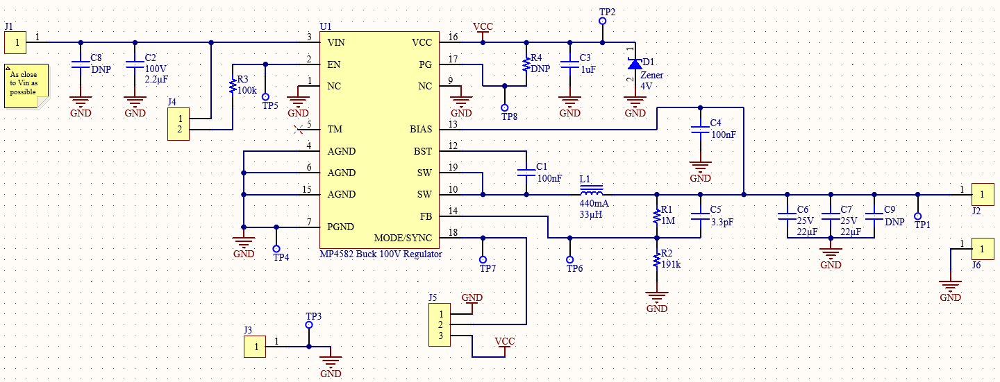
# Layout
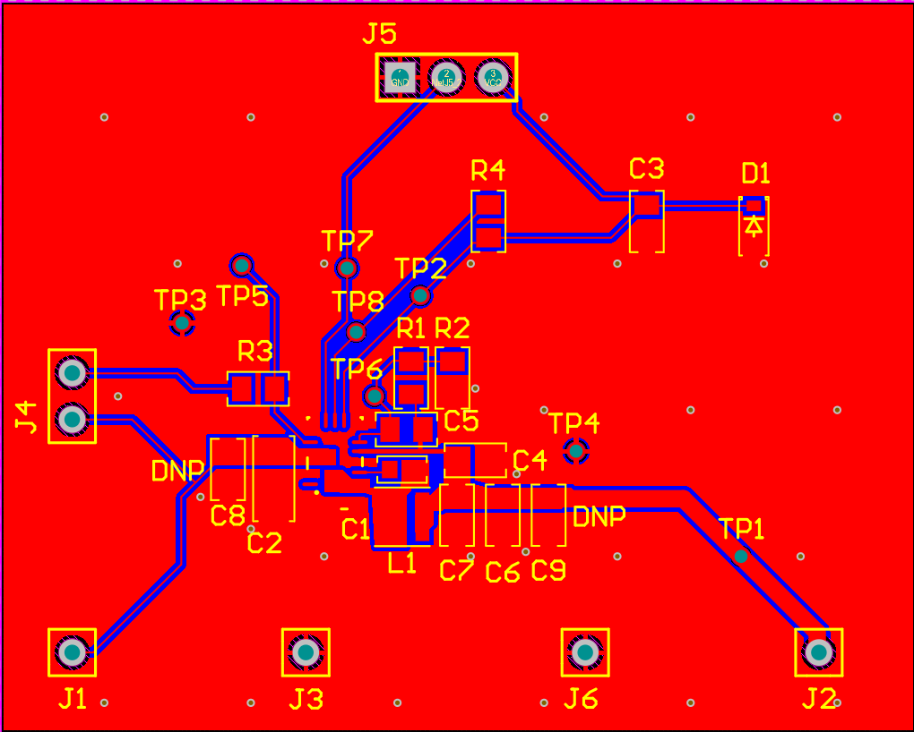
# 3D Model
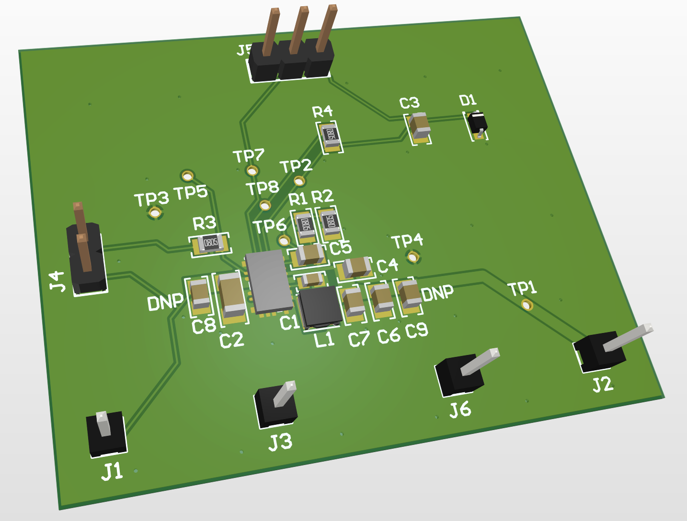
# Layout

## Overview

While this layout would likely be best executed on a larger board, or a board with more layers, due to the limits imposed upon us by our desired NGFF connection and cheap manufacturing, this board is constrained to 30mm x 80mm of area, single sided and 2 layer design. This complicates trace routing, but is doable and would not present a significant enough performance decrease to justify a large boost in spending.

- Ensure that traces are at least 0.2mm from the edges of the board. This is double the recommended spec listed for JLC economic assembly  
- Pads should not be right beside traces. Reduce the amount of traces routed immediately beside pads, as this could cause manufacturing issues  
- Ensure a minimal return path to V- all across the board, using vias and both layers

## MP4582
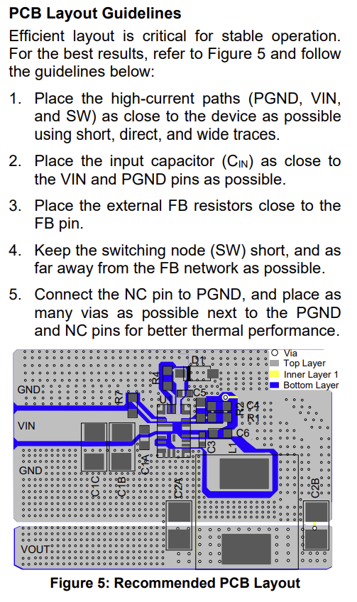
- In general, make sure the “high current” path is as condensed as possible  
- Expand traces for the higher current paths

## ADBMS1818
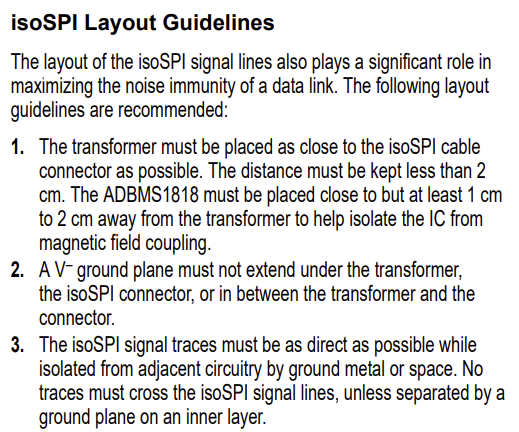
- Make sure transformers are as close as possible to the connector, as far as possible from the ADBMS1818, and are isolated from adjacent ground planes and other traces.  
- Ensure RC filtering of C lines are as close to the IC as possible

## Balance Lines

- Ensure the current path is as tight as possible. This is the highest current path by far of the entire PCB. This means placing them close to the connector, one next to the other (heatsink?) and routing efficiently/with at least 0.2mm traces. 
  
