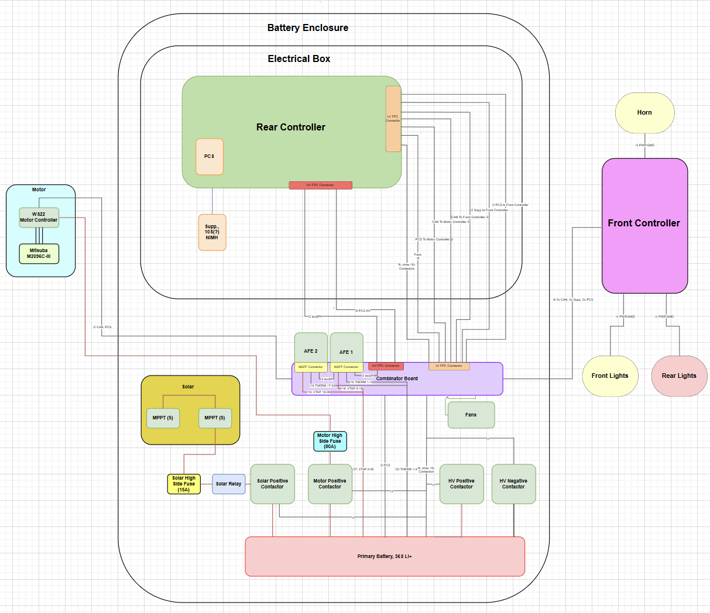
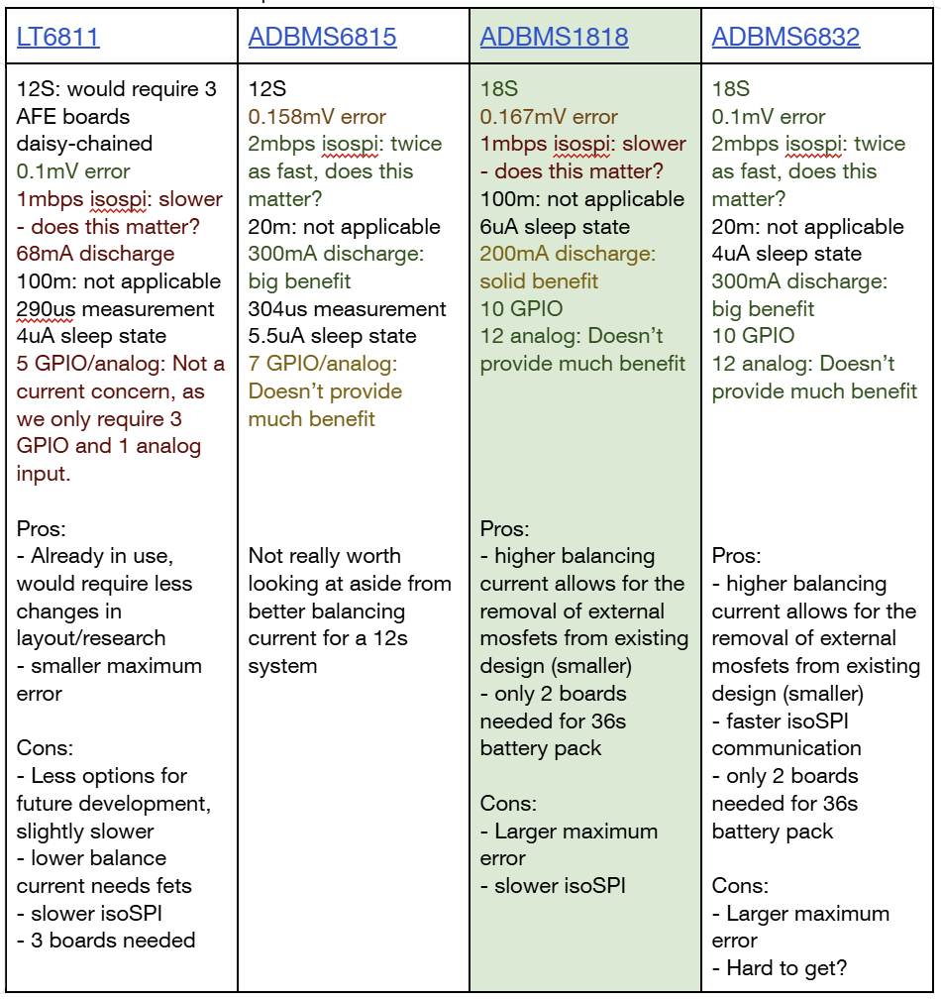
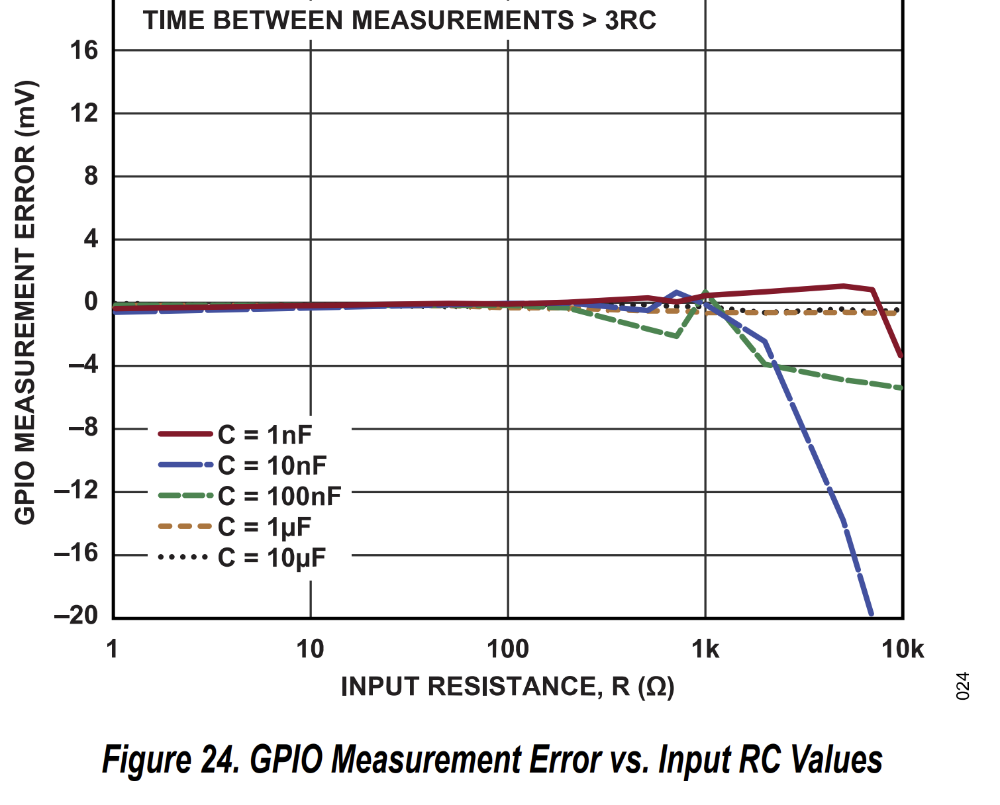
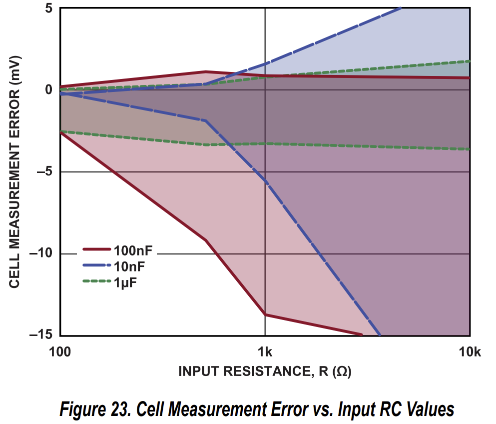
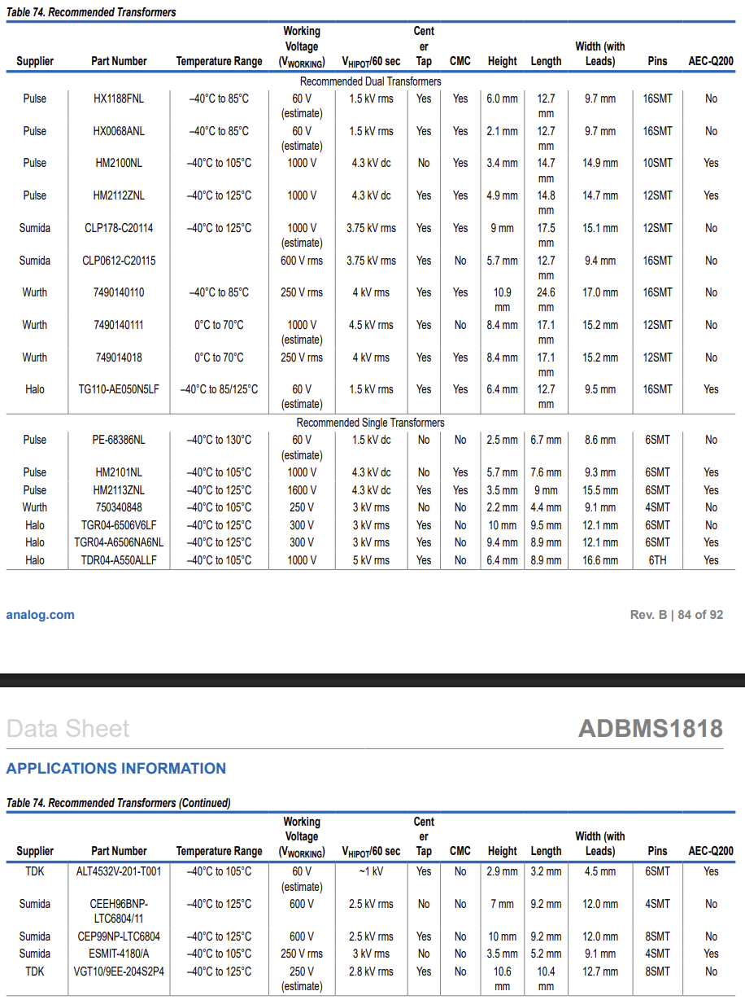
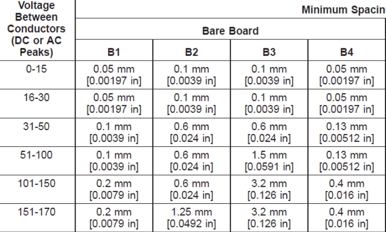
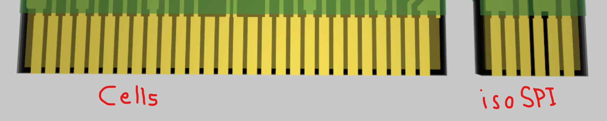
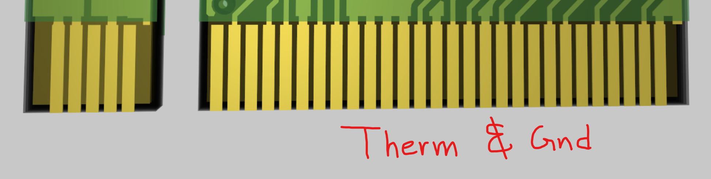

# MSXVI AFE Research

## Goals

* Condense the MSXV design  
* Switch from pin connectors to an NGFF key connection  
* General optimizations

## Notes

* Look at the current buck regulator \-\> Simplify?  
* Reassess each component, find an LCSC code for each  
* Reuse modified controller board footprint for NGFF  
* 0402 instead of 0603?  
* LEDs if space  
* More heat capable resistors  
* DTEN/WDT pins?

## Eval Board

[https://www.analog.com/media/en/technical-documentation/app-notes/an-2093.pdf](https://www.analog.com/media/en/technical-documentation/app-notes/an-2093.pdf) 

# Component selection

## AFE IC

\*Datasheets linked to components

Will approach this design (tentatively) using the ADBMS1818

## Balance Line

The Cn and Sn pins do not require any resistor/mosfet/capacitor between themselves and the cell inputs, unlike MSXV’s design.  
^**WRONG:**

We must have a resistor on the S line to dissipate most of the heat/current before entering the adbms. This calculation is done by dividing the nominal cell voltage of our batteries (3.635V) by the balance current (200mA). The ideal resistor on each line will therefore be 18.175 ohms… use 18.2 for a normal component value. The power dissipated here will be: 728mW… this is quite a bit and will require consideration on resistor power ratings.  
Wait, we don’t want the balancing current to exceed 200mA: There is no given berth for this. Let's redo the calculation and give a little bit of a berth: 3.635V/0.18A \= 20.2, using a 20.5 ohm resistor the balance current will just barely exceed 200mA (204mA) at 4.2V. This should be okay especially considering the internal 10 ohm resistor. So we need a 20.5 ohm resistor with a  voltage rating of 100V, and power rating greater than (0.2)^2\*20.5=820mW. Looks like it will likely be an 0603 package solution.

RC filtering: could be useful in allowing for more accurate voltage measurement on each cell. Is it worth the space it will take up? First let’s see what size of resistors and capacitors will be needed:  
According to the datasheet and many other sources such as [this](https://community.nxp.com/t5/Other-NXP-Products/MC33774-RC-filter-design-for-cell-voltage-sensing/m-p/1908729), the filter resistors should all stay as close to 10 ohms as possible (this is not applicable to the *RC filter resistor* which is not on the balancing line). The power dissipated across this resistor will be minimal, as the largest current draw on V+ is in the low milliamps. No consideration needed. Voltage rating also won’t need to be considered much… an 0201 could likely work for this purpose (Afternote: 0402 basic will be cheaper and not too much more space). I think the benefit of the filter outweighs the small space taken up. So, going ahead with this, we need an ~~0201~~ 0402 100 ohm resistor on each C line. What about the capacitor? The datasheet recommends in typical applications a 100nF capacitor going to ground line. This would require a 100V rating. Do we need a capacitor between each line?  
Taking a step back and looking at the provided graphs on the next page, I believe that a 10nF capacitor would pair best with a 100 ohm resistor in order to minimize measurement error in voltage and GPIO. Due to the nature of our application, only one filter type should be needed (we could likely get away with no filter, but I believe the space trade off is worth it). Differential filtering (between lines, not from lines to ground) appears to be the most effective method of filtering, although both would work fine. So, a 10nF cap with a 25V rating would be effective enough. This can likely be 0402 package.

Final considerations:  
\- Do we need an LED to indicate balancing? This would require adding 2 components on each line (36 more components… likely 0402… yikes. Especially with the RC filter already adding 2 components per line). I don’t think the convenience of an LED is worth the space.  
\- Fuses\! Need to fuse at \_\_\_mA.

## isoSPI prep

Capacitive coupling vs Transformer isolation  
Transformer will take up more space but is more reliable and better suited for our application  
Transformer used by eval example: [HM2102NL](https://www.mouser.ca/datasheet/2/447/HM2102NL-2903283.pdf)  
Final daisy chain unused terminal… must be terminated… could be done by the control board in order to maintain identical afe’s? **Yes \- controller board will need 100 ohm termination on the 2nd (daisy chained) AFE IPB/IMB pins**

**NOTE**: “The isoSPI signal traces must be as direct as possible while isolated from adjacent circuitry by ground metal or space. No traces must cross the isoSPI signal lines, unless separated by a ground plane on an inner layer.”

List of recommended transformers on the next page

“The hardware design of a daisy-chain isoSPI bus is identical for each device in the network due to the daisy-chain point to point architecture. The simple design as shown in Figure 103 is functional, but inadequate for most designs. The termination resistor, RM, must be split and bypassed with a capacitor, as shown in Figure 104\. This change provides both a differential and a common mode termination, and as such, increases the system noise immunity.”  
^this is not needed for our short transmission applications

This transformer matches the specs of the recommended ones, but is smaller:

[https://www.lcsc.com/datasheet/lcsc\_datasheet\_2410122041\_CND-tek-MA021G00\_C19724713.pdf](https://www.lcsc.com/datasheet/lcsc_datasheet_2410122041_CND-tek-MA021G00_C19724713.pdf) 

“Select IB and K (signal amplitude VA to receiver comparator threshold ratio) according to the application: ► For lower power links: IB \= 0.5 mA and K \= 0.5. ► For full power links: IB \= 1 mA and K \= 0.5. ► For long links (\>50m): IB \= 1 mA and K \= 0.25. For applications with little system noise, setting IB to 0.5 mA is a good compromise between power consumption and noise immunity. Using this IB setting with a 1:1 transformer and RM \= 100 Ω, RB1 must be set to 3.01 k, and RB2 set to 1 kΩ.”

## Regulator

While it is possible to use an npn transistor to generate the 5V0 required for Vreg, it is more efficient to use a switching regulator  
Refer to page 71 of the datasheet  
Recommended component: [https://www.analog.com/media/en/technical-documentation/data-sheets/lt8631.pdf](https://www.analog.com/media/en/technical-documentation/data-sheets/lt8631.pdf)   
This is small, is powerful enough and well suited for our application. I don’t see any reason to find an alternate. Nevermind its expensive, see below.

Could we put the regulator on the rear controller, and send Vreg to the AFE’s via one of the NGFF ports? This would save space on the AFE’s and the cost of duplicating components.  
**NO \- Different Ground on each AFE**

The recommended regulator is very expensive… so, as a result, let’s look for different, cheaper and more efficient options.

We are going to go with the MP4582 100V buck converter due to the parts being free (sponsorship kinda), as well as it being a much cheaper alternative to the analog recommended component above.

Inductor: Based on formulas and information provided by the MP4582 Datasheet, we selected a 33uH inductor rated for saturation at 440mA. This is enough as the largest current it could face is approximately 240mA

Input & Output capacitors: Based on formulas on the datasheet, for a 0.1V fluctuation due to switching current draw, we should include parallel capacitance on the Vin line in order to prevent major stress on the V+ supply. For this we will use a 2.2uF capacitor rated for 100V (76.5V to ground is needed). For output, see also the formulas located in the buck converter datasheet. We have chosen the recommended 22uF.

A 3.3pF capacitor has been placed on the FB line to the Vout line in order to combat HF noise caused by switching and neglected by the large 1M ohm resistor. This is in accordance with the recommended application diagram on the datasheet.

# NGFF Considerations

Taking into account 2 thermistors per module, each requiring their own ground:

Number of pins needed for 18s AFE (4.5 modules):  
19 cell pins  
4.5\*(2therm \+ 2ground) \= 18 therm/gnd pins  
2 isospi pins  
19+16+2= 37

Number of pins needed for 12s AFE (3 modules):  
13 cell pins  
3\*(2therm \+ 2gnd) \= 12 therm/gnd pins  
2 isospi pins  
13+12+2= 27

An NGFF key will always have 67-75 pins. Either way we will be leaving some connections unused so no consideration needed there.  
One more thing to consider: ipc standards \-\> must follow below:

Likely qualifies as B4? Maybe B2. Doesn’t really matter \-\> focus on layout  
So another chart:

| Pin | Max voltage (\~) relative to Vbat- |
| :---- | :---- |
| Cell\_0 Cell\_1 Cell\_2 Cell\_3 Cell\_4 Cell\_5 Cell\_6 Cell\_7 Cell\_8 Cell\_9 Cell\_10 Cell\_11 Cell\_12 Cell\_13 Cell\_14 Cell\_15 Cell\_16 Cell\_17 Cell\_18 Therm\_1 ThermGnd\_1 Therm\_2 ThermGnd\_2 Therm\_3 ThermGnd\_3 Therm\_4 ThermGnd\_4 Therm\_5 ThermGnd\_5 Therm\_6 ThermGnd\_6 Therm\_7 ThermGnd\_7 Therm\_8 ThermGnd\_8 Therm\_9 ThermGnd\_9 IsoSPI+ IsoSPI- | 0 4.25 8.5 12.75 17 21.25 25.5 29.75 34 38.25 42.5 46.75 51 55.25 59.5 63.75 68 72.25 76.5 3 0 3 0 3 0 3 0 3 0 3 0 3 0 3 0 3 0 Between 0 and 5 Between 0 and 5 |

Possible Layout:  
Cell pins in order on top side, along with isospi on the notch  
Therm and gnd pins in order on the bottom side, notch empty

Idea:

^This layout will work for both 12s and 18s variations, but we are going to use 18s
